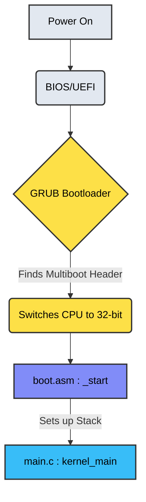
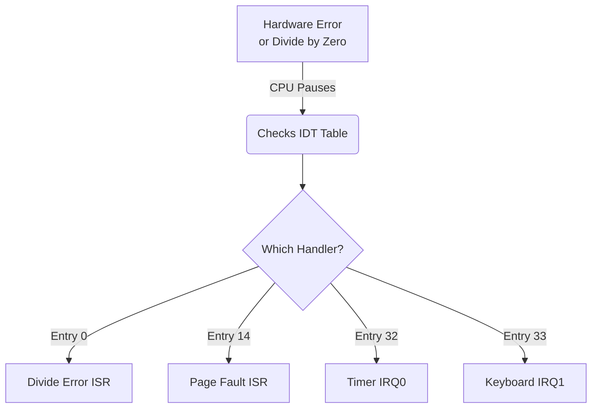
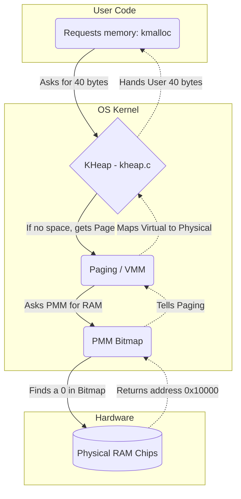
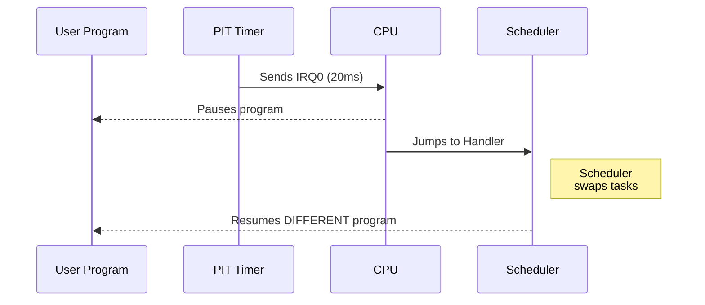
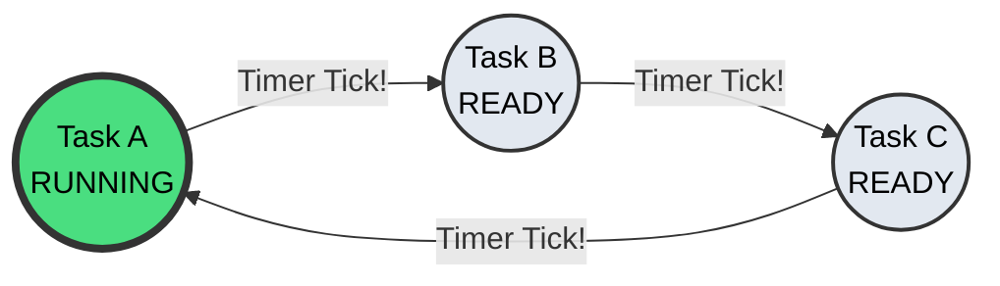

# MINI OS (Minimal Educational x86 Kernel)

MINI OS is a custom-built, bare-metal 32-bit operating system kernel developed for educational purposes and systems-level architecture demonstration. It dives deep into CPU modes, hardware interaction, and low-level software abstractions.

This guide maps out how the code works under the hood from the exact moment the PC turns on, all the way to multitasking user processes.

---

## Architecture & Execution Flow

### 1. The Boot Sequence
The operating system begins life in 16-bit real mode. The BIOS does hardware checks and hands control to GRUB. Because your `boot.asm` contains a special "Multiboot Header", GRUB knows how to load it. GRUB switches the CPU to 32-bit protected mode and hands control to your assembly entry point `_start`.



#### Stack Setup (`boot.asm`)
C code cannot execute without a stack (it needs memory to store variables and return addresses). The assembly code creates a 16KB stack and sets the `esp` register before calling your C function.

```nasm
; Create 16KB stack in the BSS section
section .bss
align 16
stack_bottom:
resb 16384 ; 16 KiB
stack_top:

section .text
global _start
_start:
    ; 1. Point the stack pointer to the top of our 16KB space
    mov esp, stack_top

    ; 2. Push the Multiboot args (magic number and memory map pointer)
    push eax
    push ebx

    ; 3. Jump to the C code!
    extern kernel_main
    call kernel_main
```

---

### 2. CPU Protection (GDT & IDT)
Once inside C code, the CPU is extremely fragile. A single math error will crash the computer. You immediately set up two vital data structures: the **GDT** (Global Descriptor Table) to define memory boundaries, and the **IDT** (Interrupt Descriptor Table) to catch errors and hardware signals.



#### Loading the GDT (`gdt.c`)
This table defines your kernel's physical memory boundaries and permissions.

```c
void gdt_install() {
  // gp is the pointer we pass to the CPU
  gp.limit = (sizeof(struct gdt_entry) * 3) - 1;
  gp.base = (uint32_t)&gdt;

  // Entry 0: Null descriptor (required by x86 CPU)
  gdt_set_gate(0, 0, 0, 0, 0);

  // Entry 1: Code Segment (starts at 0, limit 4GB, readable, executable)
  gdt_set_gate(1, 0, 0xFFFFFFFF, 0x9A, 0xCF);

  // Entry 2: Data Segment (starts at 0, limit 4GB, readable, writable)
  gdt_set_gate(2, 0, 0xFFFFFFFF, 0x92, 0xCF);

  // Calls the assembly wrapper 'lgdt' to load this table into the CPU
  gdt_flush((uint32_t)&gp);
}
```

---

### 3. Memory Management
Your OS separates memory into three distinct layers. First, the **PMM** (Physical Memory Manager) tracks physical RAM chips. Second, the **VMM** (Paging) maps virtual addresses to physical ones. Finally, the **Kernel Heap** provides `kmalloc()` for dynamic variables.



#### Finding Free RAM (`pmm.c`)
The PMM uses a massive array of bits (a bitmap). 0 means the memory block is free, 1 means it is used.

```c
uint32_t pmm_alloc_page(void) {
  // Loop through all possible 4KB blocks in RAM
  for (uint32_t i = 0; i < pmm_max_blocks; i++) {
    if (!bitmap_test(i)) {  // If bit is 0 (Free)
      bitmap_set(i);        // Mark as 1 (Used)
      pmm_used_blocks++;
      return i * PAGE_SIZE; // Return the exact physical memory address
    }
  }
  return 0; // System is completely out of memory!
}
```

---

### 4. Hardware Drivers (Timer & Keyboard)
Your OS communicates with the outside world using specific hardware ports via `inb` and `outb` instructions. The most crucial driver is the Timer (PIT), which is the beating heart of your OS scheduler.



#### Configuring the Motherboard Timer (`timer.c`)
```c
void init_timer(uint32_t frequency) {
  // Tell IDT that IRQ0 (Interrupt 32) should trigger 'timer_callback'
  register_interrupt_handler(32, timer_callback);

  // The base clock of the chip is 1193180 Hz. We divide it to get 50Hz.
  uint32_t divisor = 1193180 / frequency;

  // 0x43 is the Command Port. Tell chip we are updating frequency.
  outb_timer(0x43, 0x36);

  // Send the divisor over port 0x40 (Data Port), one byte at a time.
  uint8_t l = (uint8_t)(divisor & 0xFF);
  uint8_t h = (uint8_t)((divisor >> 8) & 0xFF);
  outb_timer(0x40, l);
  outb_timer(0x40, h);
}
```

---

### 5. Process Scheduler (Multitasking)
Your OS uses a preemptive round-robin scheduler. When the Timer fires its 50Hz tick, the OS stops whatever it is currently doing, saves all the CPU registers, grabs the registers for the next task in the circular linked list, and restores them.



#### The Software Switch (`scheduler.c`)
The `schedule` function calls a raw assembly function `context_switch` which forcefully manipulates the CPU Stack Pointer (`ESP`) to trick the CPU into returning to a different function than the one it started in.

```c
void schedule(registers_t *regs) {
  if (!scheduler_enabled || !current_process) return;

  process_t *prev = current_process;
  process_t *next = current_process->next;

  // Skip processes that are blocked or dead
  while (next->state != PROCESS_READY && next->state != PROCESS_RUNNING) {
    next = next->next;
    if (next == prev) return; 
  }

  // Update states
  prev->state = PROCESS_READY;
  next->state = PROCESS_RUNNING;
  current_process = next;

  // The ultimate trick: swap the ESP (Stack Pointer) using Assembly
  context_switch(&prev->esp, next->esp);
}
```

---

## Build and Run Instructions

### Prerequisites (macOS/Linux)
You will need `i686-elf-gcc`, `nasm`, and `qemu`.

**macOS (via Homebrew)**
```bash
brew install i686-elf-gcc nasm qemu
```

### Execution
Running locally is fully supported by the included `Makefile`. Simply run:
```bash
# Compile everything and run in the QEMU emulator
make run
```

*Note: The script outputs `build/minios.bin` and feeds it directly into QEMU via the `-kernel` command, skipping grub-mkrescue ISO wrappers.*

